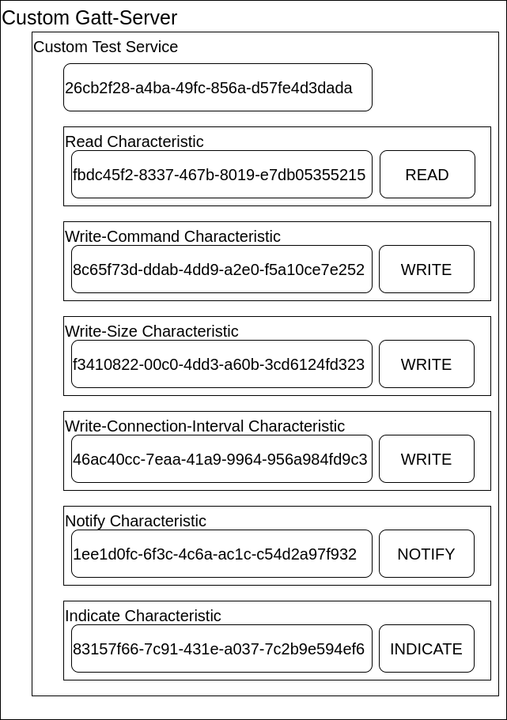

# Bachelor Thesis of Anton Saatze
This Repository is split to three different code bases.

## Android
The code for the android App can be found in the android folder.

The app is designed to establish a connection with the bluetooth low energy server. After a connection is established, different settings can be applied and data can be read from the server.

## Ble Server
The code for the esp32 Server can be found in the server folder. 

The server is designed to be in advertising mode when no connection is established. If it is connected, the following characteristics are available:  

## Jupyter
The code for the processing of recorded values can be found in the jupyter folder.

HCI-Traces and OTA-Traces can be opened in Wireshark and can be exported as CSV-Files
